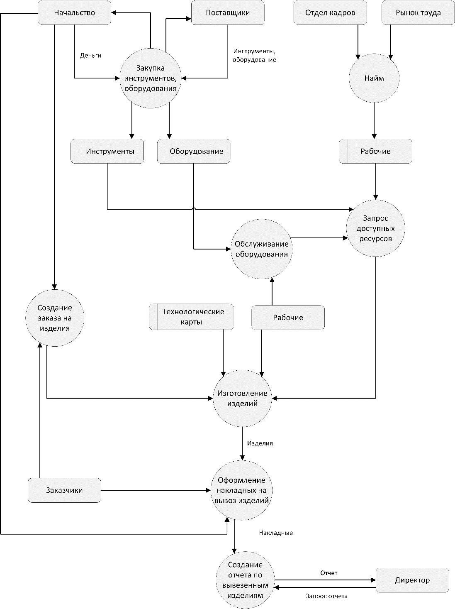
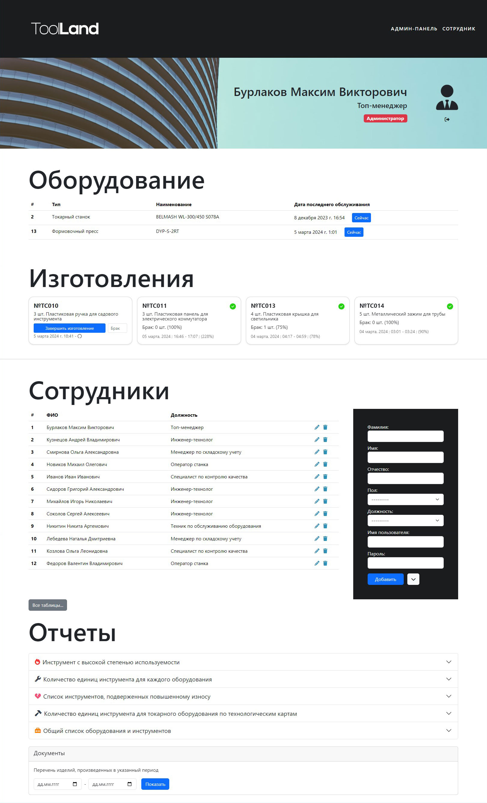

# Инструментальный склад


<table cellpadding="0">
    <tr style="padding: 0">
        <td valign="top"></td>
        <td valign="top"></td>
        <td valign="top"></td>
    </tr>
</table>

Python, Django | Bootstrap

## Техническое задание

Создать БД инструментального склада. Ориентировочные таблицы-составляющие: "Обслуживаемое оборудование", "Инструмент", "Технологические карты", "Рабочие".

Бизнес-логика:
- Увеличение степени износа инструментов после изготовления.
- Разделение прав доступа администратор / сотрудник.
- При создании записи изготовления кол-во требуемых инструментов не должно превышать количество имеющихся.
- При создании записи изготовления требуемое количество инструментов резервируется на время всего изготовления.

Ограничения:
- Все даты не могут быть позже, чем текущая дата.
- Дата конца производства должна быть позже, чем дата его начала.
- Последнее обслуживание оборудования не может быть раньше, чем дата ввода его в эксплуатацию.
- Поля во всех таблицах обязательны к заполнению, кроме записей об ответственных сотрудниках, датах окончания изготовления, количестве брака.
- Количество инструментов, среднее время изготовления являются целыми неотрицательными числами.
- Степень износа является целым числом в диапазоне 0 ÷ 1000.

## Начало работы

### Docker

```bash
docker compose up --build
```

Приложение будет доступно по адресу: http://localhost:8000.

### Manual

```bash
pip install -r requirements.txt
python3 manage.py makemigrations
python3 manage.py makemigrations storage
python3 manage.py migrate
```

## Цель и задачи проектирования

Разрабатываемая БД предназначена для организации работы инструментального склада. Конечной целью проектирования является создание координированной БД, позволяющей совершать поиск, редактирование информации, выполнение различных запросов и просмотр отчетов из форм и обладающей интерфейсом, удобным для пользователей. 

Результатом анализа является формирование накладной с перечнем всей продукции, изготовленной в заданный период времени.

**Основными задачами проектирования любой БД являются:**

1. Обеспечение хранения в БД всей необходимой информации. 
2. Обеспечение возможности получения данных по всем необходимым запросам. 
3. Сокращение избыточности и дублирования данных. 
4. Обеспечение целостности данных (правильности их содержания): исключение противоречий в содержании данных, исключение их потери и т.д. 
5. Упрощение управления данными. 

**Простые ограничения:**

1. Дата последнего обслуживания оборудования не может быть меньше, чем дата ввода его в эксплуатацию. Дата конца производства должна быть позже, чем дата его начала. Все даты не могут быть позже, чем текущая дата. 
2. Все поля в таблицах «Рабочие», «Типы оборудования», «Обслуживаемое оборудование», «Технологические карты», «Инструменты» не могут быть пустыми, кроме записей об ответственных сотрудниках, датах окончания изготовления, количестве брака. 
3. Количество инструментов, среднее время изготовления являются целыми неотрицательными числами. 
4. Степень износа является целым числом в диапазоне 0 ÷ 1000. 

**Сложные ограничения (бизнес-логика):**

1. Увеличение степени износа инструментов после изготовления. 
2. Разделение прав доступа администратор / сотрудник. 
3. При создании записи изготовления кол-во требуемых инструментов не должно превышать количество имеющихся. 
4. При создании записи изготовления требуемое количество инструментов резервируется на время всего изготовления.

## Диаграммы

**DFD-диаграмма:**



**ERD-диаграмма:**


## Скриншоты



## Заключение

В результате разработки базы данных инструментального склада была систематизирована вся информация, необходимая для четкого функционирования организации, создан удобный пользовательский интерфейс, позволяющий осуществлять все желаемые действия с БД, включая навигацию по БД, просмотр отчетов, редактирование информации, не требуя серьезной подготовки. 