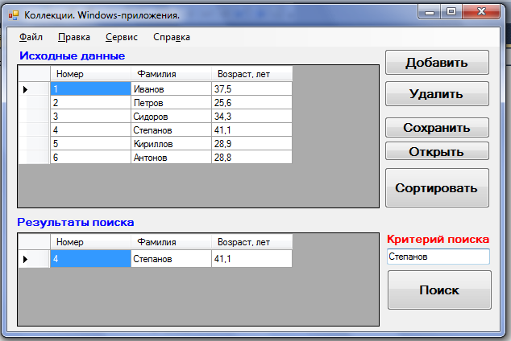

## Задание 1. Классы и объекты. Инкапсуляция. Полиморфизм.
Создать класс библиографических описаний книг BookCard. Класс должен содержать поля: Автор, Заглавие, Издательство, 
Год издания, УДК, Тираж, Рейтинг (изменяется от 0 до 7) - обеспечить проверку правильности введенных значений.

1. Все поля должны быть закрытыми. Для всех их должны быть созданы методы доступа (или свойства). 
2. В конструкторе за исключением рейтинга должна осуществляться инициализация всех полей. 
3. Необходимо создать метод, выводящий описание книги в строку (переопределение метода `__str__`), в которой будут 
присутствовать все значения полей класса. В данном методе значение поля УДК выводится через пробел без использования 
знаков препинания. Значения атрибутов рейтинг и тираж должны выводиться в следующей форме: Тираж: <значение тиража>. 
Рейтинг: <значение рейтинга>.
4. Создать два объекта библиографических описаний книг. Вызвать для них метод, осуществляющий вывод строки 
библиографического описания. Можно использовать как реально существующие книги, так и чисто гипотетические.
5. Создать массив (размерностью не более 5) объектов библиографических описаний книг. Создать статический метод для 
упорядочивания (по году издания) данного массива. Вывести на экран значения массива до сортировки и после сортировки.
6. Оформить отчет по заданию №1 курсовой работы.

## Задание 2. Наследование. Полиморфизм.
Необходимо реализовать иерархию классов предметной области в соответствии с заданием:

Новогодний подарок. Определить иерархию конфет и прочих сладостей. Создать несколько объектов-конфет. Собрать детский 
подарок с определением его веса.

1. Иерархия классов должна состоять не менее чем из 3-х уровней. 
2. Каждый класс должен содержать уникальный набор полей. 
3. В классах не должно быть открытых полей (должны быть модификаторы доступа private или protected). Для доступа к 
полям класса необходимо использовать свойства.
4. В процессе реализации иерархии классов использовать абстрактные классы.
5. Классы рекомендуется оформить в виде библиотеки классов. Проверку функциональности осуществить в консольном проекте.
6. В рамках решения создать диаграммы классов.
7. Оформить отчет по заданию №2 курсовой работы.

## Задание 3. Коллекции. Windows-приложения.
Создать класс, соответствующий заданию. Создать коллекцию для хранения экземпляров созданного класса. Вид коллекции 
выбрать самостоятельно. Написать Windows-приложение для работы с этой коллекцией, которое позволит выполнять:

1. добавление элемента в коллекцию с клавиатуры;
2. считывание данных из файла;
3. запись данных в тот же или указанный файл;
4. сортировку данных по различным критериям;
5. поиск элемента по заданному полю;
6. вывод всех элементов, удовлетворяющих заданному условию;
7. удаление элемента из коллекции.

Приложение должно содержать меню, диалоговые окна и предусматривать обработку ошибок.  
Оформить отчет по заданию №3 курсовой работы.

Описать класс с именем STUDENT, содержащий следующие поля: Фамилия и инициалы; Номер группы; Успеваемость (массив из 
пяти элементов).

Написать программу, выполняющую следующие действия:
1. см. общее задание;
2. ввод с клавиатуры данных (записи должны быть упорядочены по алфавиту);
3. вывод на экран фамилий и номеров групп для всех студентов, имеющих хотя бы одну оценку 2 (если таких студентов нет, 
вывести соответствующее сообщение).

