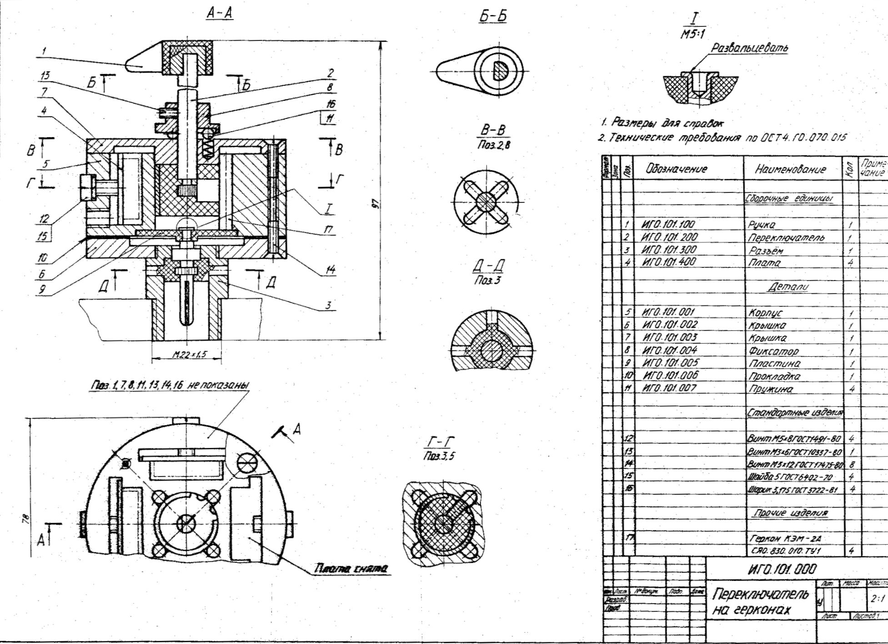
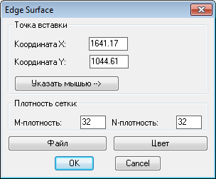
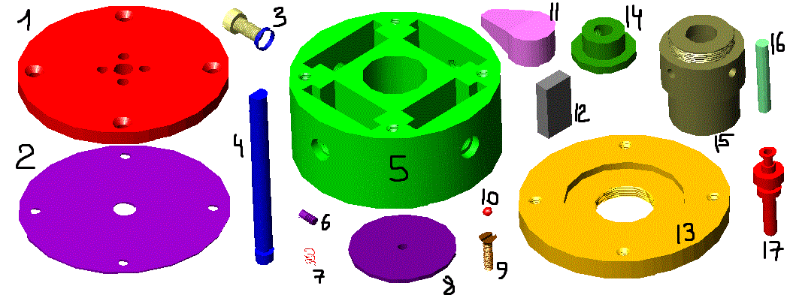

# САП (ОСАПР), семестр 4

🔑 Основы систем автоматизированного проектирования

**Вариант 2**

## lab 1. Создание плоского чертежа в среде AutoCAD

### [lab1.dwg](lab1/lab1.dwg)

ИГО. 101.000 Переключатель на герконах.
Переключатель на герконах предназначен для деления или переключения высокочастотных сигналов и используется при регулировании телевизионной аппаратуры. В корпусе (5) установлены четыре магнитоуправляемых контакта-геркона (17), связанные с внешней электрической цепью посредством плат (4) ж разъёма (3). Поворотом ручки (1) магнитная вставка, закреплённая в переключателе (2), устанавливается у одного из герконов. При этом положение переключателя (2) фиксируется шариком (16) и пружиной (11). Внутренняя разводка проводов между герконами, платами и разъёмом на чертеже НЕ показана.
Для деталирования рекомендуются:
- поз. 1 - ручка. Состоит из стальной втулки спрессованной пластмассой (прессматериал АГ-4В ГОСТ 20437-75);
- поз. 3 - разъём. Состоит из стальной втулки, латунного контакта, спрессованных пластмассой (прессматериал АГ-4В ГОСТ 20437-75);
- поз. 5 - корпус. Материал - алюминиевый" сплав (сплав АЛ-2 ГОСТ 2685-75);
- поз. 7 - крышка. Материал - алюминиевый сплав(сплав АЛ-2 ГОСТ 2685-75);
- поз. 8 - фиксатор. Материал - сталь (сталь 45 ГОСТ 1050-74);
- поз. 10 - прокладка. Материал - злектрокартон (картон ЗВ-1.0 ГОСТ 2824 -75).

## lab 2. Программирование на языке AutoLISP в среде AutoCAD

### [laba.lsp](lab2/laba.lsp) + [dcl.dcl](lab2/dcl.dcl)

### [Попытки на Python](lab2/Python/)

Создание поверхностей на базе четырёх образующих полилиний (команда AutoCAD edgesurf). В файле содержится информация в произвольном формате, описывающая четыре полилинии, соединённые друг с другом в началах и концах. Полилинии могут состоять из отрезков и дуг. Программа должна обеспечивать:

- выбор цвета поверхности через стандартное меню AutoCAD;
- выбор файла с данными об образующей полилинии через стандартное меню AutoCAD;
- задание точки вставки поверхности указанием на экране координат с помощью мыши, при котором диалоговое окно временно закрывается, давая пользователю возможность указать точку на графическом экране в интерактивном режиме, после чего диалоговое окно снова должно появиться на экране с отображением указанных координат X, Y в соответствующих полях редактирования EditBox для возможности коррекции значений в них;
- задание точки вставки поверхности указанием координат X, Y в соответствующих полях редактирования EditBox в диалоговом окне;
- возможность задания количества лоскутов разбиения поверхности (переменные AutoCAD surftab1, surftab2) в полях редактирования EditBox.

Примерный вид диалогового окна:

## lab 3. Создание объёмных деталей в Autodesk Inventor

### 🔗 [Детали](lab3/)

Cоздать в системе автоматизированного проектирования Autodesk Inventor параметризованные детали узла на базе чертежа, созданного в лабораторной работе №1. Для одной из деталей (Part) предусмотреть индивидуальную таблицу переменных параметров.

