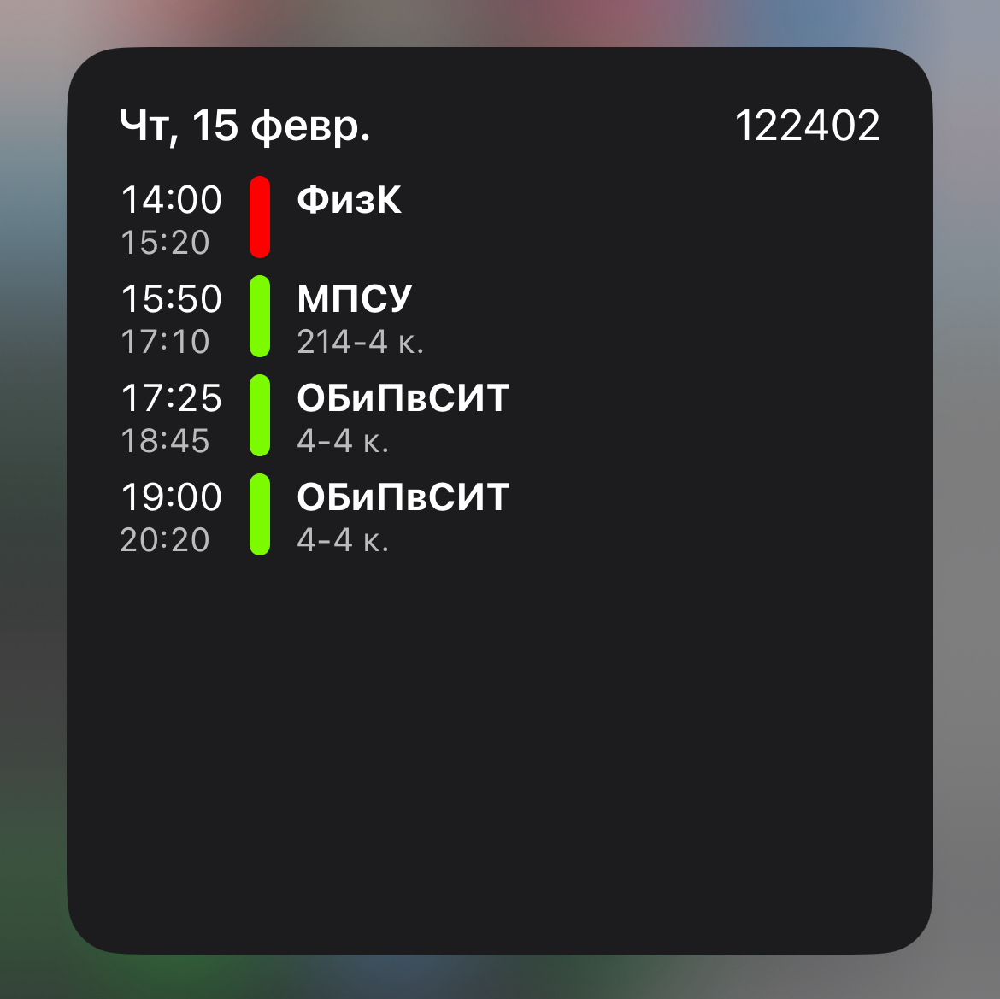

# Полезности

## Виджет расписания на iOS

**🔗 [Schedule.js](Schedule.js)**

Скрипт для приложения [Scriptable](https://scriptable.app). Получает расписание указанной группы `groupNum` по API. Пары также отображаются по подгруппам, в `subgroupNum` указывается номер подгруппы, 0 для отображения пар всех подгрупп. 

