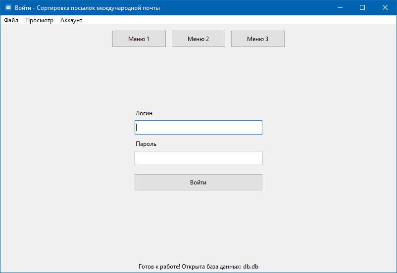
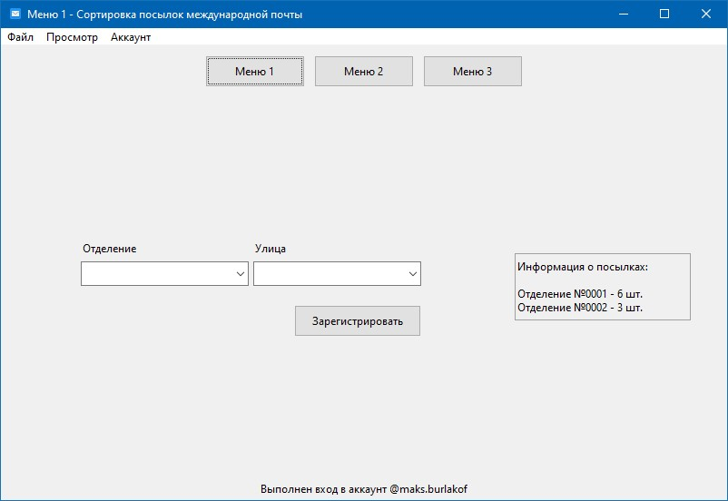
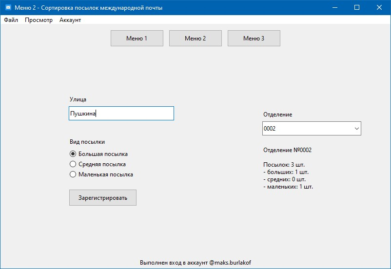
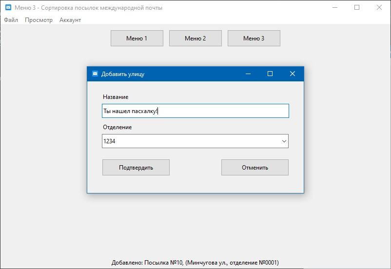

# Сортировка посылок международной почты

Информационная система должна обеспечить распределение посылок между условными участками, которые привязаны к названиям улиц.

Содержание:
- [Меню 1](#меню-1)
- [Меню 2](#меню-2)
- [Меню 3](#меню-3)
- [Начало работы](#начало-работы)
- [Скриншоты](#скриншоты)

## Меню 1

Допустим, что распределение происходит между 3мя условными отделениями (А, Б, В), каждому из которых соответствует 3 улицы (а, б, в). Названия могут быть выбраны произвольно.  Реализовать объект «отделение», включающий имя и названия всех улиц, соответствующих данному отделению. Добавить на основной экран два раскрывающихся списка: выбор отделения, выбор улицы. Также добавить кнопку «зарегистрировать посылку» и текстовое поле, отображающее количество посылок, зарегистрированных для каждого отделения в произвольном формате. 

Дополнительное задание: подгружать данные в память при старте программы.

## Меню 2

Убрать раскрывающийся список выбора улицы. Добавить текстовое поле ввода. В текстовое поле вводится название улицы, на которую отправляется посылка. Проверять правильность ввода информации, выводить ошибки в текстовое поле вывода. Теперь имеется три вида посылок: большие, средние и маленькие. Добавить три радиокнопки: «большая посылка», «средняя посылка», «маленькая посылка». После нажатия кнопки «зарегистрировать посылку», при правильном вводе адреса, на соответствующее адресу отделение должна записываться выбранная посылка. Отображать в текстовом поле вывода информацию о количестве и видах посылок для выбранного, в раскрывающемся списке отделений, отделения. 

## Меню 3

Все ошибки, обрабатываемые ранее, должны быть переведены на всплывающие окна с соответствующей информацией. Добавить на основной экран кнопки: «добавить отделение», «добавить улицу», «состояние отделения». Убрать информацию о количестве посылок в отделении и раскрывающийся список отделений на основном экране. При нажатии на кнопку «состояние отделения», открывать новое диалоговое окно, содержащее раскрывающийся список отделений и текстовое поле, в котором отображать информацию о количестве посылок в выбранного отделении. Добавить на диалоговое окно кнопку «добре», нажатие на которую закрывает диалоговое окно. При нажатии на кнопку «добавить отделение», открывать диалоговое окно, содержащее текстовое поле ввода и текстовое поле вывода, отображающее номера других отделений, а также кнопки «подтвердить» и «отменить». Нажатие на кнопку «отменить» закрывает окно. В текстовое поле осуществляется ввод номера нового отделения. Проверять ввод на правильность и уникальность. Нажатие на кнопку «подтвердить» добавляет новое отделение. Если номер отделения введен неправильно, отобразить всплывающее окно с текстом ошибки и кнопкой «ok», закрывающей всплывающее окно. При нажатии на кнопку «добавить улицу», открывается диалоговое окно, содержащее: текстовое поле ввода названия улицы, раскрывающийся список отделений (для ассоциации улицы с отделением) и две кнопки: «подтвердить» и «отменить», работающие аналогично описанным выше.

## Начало работы

```bash
python3 main.py
```

- [db.py](db.py) - содержит методы для работы с базой данных SQLite
- [generics.py](generics.py) - классы основных объектов задания
- [localmemory.py](localmemory.py) - класс локальной памяти приложения
- [main.py](main.py) - точка входа в приложение
- [mainwindow.py](mainwindow.py) - содержит весь графический интерфейс

## Скриншоты





